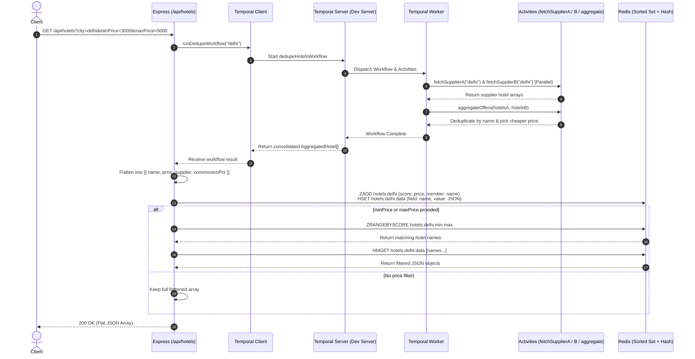

# Hotel Offer Orchestrator

## 1. Project Overview

The **Hotel Offer Orchestrator** is a Node.js + TypeScript service built with Express that aggregates hotel offers from two mock suppliers (`supplierA` and `supplierB`), deduplicates overlapping hotels by name, and selects the offer with the cheaper price. Orchestration is managed entirely through a durable **Temporal workflow** executing supplier activities in parallel, with **Redis** acting as an indexing data store (using Sorted Sets and Hashes) to provide efficient, native price-range filtering on the aggregated results.

---

## 2. Architecture & Request Flow



### Flow Breakdown:
1. **Express Receives Request**: The client requests `/api/hotels?city=delhi`.
2. **Temporal Workflow Initiated**: The Express handler calls `runDedupeWorkflow(city)` via the Temporal client.
3. **Parallel Activity Execution**: The Temporal worker executes `fetchSupplierA` and `fetchSupplierB` concurrently using `Promise.all`.
4. **Deduplication & Best Price**: The `aggregateOffers` activity merges the datasets, groups hotels by name, and selects the offer with the lowest price.
5. **Redis Indexing**: The flattened result is stored in Redis:
   - **Sorted Set (`hotels:<city>`)**: Member is `hotel.name`, score is `hotel.price`.
   - **Hash (`hotels:<city>:data`)**: Field is `hotel.name`, value is the stringified hotel JSON.
6. **Redis Range Filtering**: If `minPrice` or `maxPrice` is queried, Redis performs a native `ZRANGEBYSCORE` on the Sorted Set and fetches the records from the Hash using `HMGET`.
7. **Response**: A flat JSON array is returned to the client.

---

## 3. Prerequisites

- **Node.js** (v18+ or v20+)
- **Docker Desktop** (with Docker Compose v2+)

---

## 4. Setup & Running Locally

### Step 1: Clone the Repository & Enter Directory
```bash
git clone https://github.com/ku99al/Hotel-offer-orchestrator.git
cd hotel-offer-orchestrator
```

### Step 2: Launch the Services
Start all 4 containerized services with Docker Compose:
```bash
docker compose up --build
```

### Step 3: Verify All 4 Services are Healthy & Running
Docker Compose will launch:
- **`app`**: Express HTTP server running on `http://localhost:3000`
- **`worker`**: Temporal worker executing workflow & activities on `hotel-orchestrator-queue`
- **`temporal`**: Temporal dev server (gRPC: `localhost:7233`, Web UI: `http://localhost:8233`)
- **`redis`**: Redis server on `localhost:6379`

> **Note**: Both `app` and `worker` wait for the `temporal` service healthcheck to pass before booting. You can inspect active workflows at the Temporal Web UI: [http://localhost:8233](http://localhost:8233).

---

## 5. API Endpoints

### 1. Health Check
Verifies service uptime and probes both supplier endpoints concurrently (with a 2-second timeout).
```bash
curl http://localhost:3000/health
```
**Example Response:**
```json
{
  "status": "UP",
  "service": "hotel-offer-orchestrator",
  "timestamp": "2026-09-23T17:29:34.421Z",
  "suppliers": {
    "supplierA": "up",
    "supplierB": "up"
  }
}
```

---

### 2. Supplier A Hotels
Returns raw hotels from Supplier A filtered by city.
```bash
curl "http://localhost:3000/supplierA/hotels?city=delhi"
```
**Example Response:**
```json
[
  {
    "hotelId": "SUP-A-101",
    "name": "The Grand Palace Delhi",
    "price": 8500,
    "city": "delhi",
    "commissionPct": 12
  },
  {
    "hotelId": "SUP-A-102",
    "name": "Heritage Haveli",
    "price": 6200,
    "city": "delhi",
    "commissionPct": 10
  },
  {
    "hotelId": "SUP-A-103",
    "name": "Royal Orchid Suites",
    "price": 4500,
    "city": "delhi",
    "commissionPct": 15
  },
  {
    "hotelId": "SUP-A-104",
    "name": "Aura Boutique Stay",
    "price": 3200,
    "city": "delhi",
    "commissionPct": 8
  },
  {
    "hotelId": "SUP-A-105",
    "name": "Skyline Express Inn",
    "price": 2800,
    "city": "delhi",
    "commissionPct": 5
  }
]
```

---

### 3. Supplier B Hotels
Returns raw hotels from Supplier B filtered by city.
```bash
curl "http://localhost:3000/supplierB/hotels?city=delhi"
```
**Example Response:**
```json
[
  {
    "hotelId": "SUP-B-201",
    "name": "The Grand Palace Delhi",
    "price": 8100,
    "city": "delhi",
    "commissionPct": 10
  },
  {
    "hotelId": "SUP-B-202",
    "name": "Heritage Haveli",
    "price": 6600,
    "city": "delhi",
    "commissionPct": 14
  },
  {
    "hotelId": "SUP-B-203",
    "name": "Royal Orchid Suites",
    "price": 4300,
    "city": "delhi",
    "commissionPct": 11
  },
  {
    "hotelId": "SUP-B-204",
    "name": "Metro Elegance Hotel",
    "price": 3900,
    "city": "delhi",
    "commissionPct": 9
  },
  {
    "hotelId": "SUP-B-205",
    "name": "Green Oasis Retreat",
    "price": 5200,
    "city": "delhi",
    "commissionPct": 13
  }
]
```

---

### 4. Orchestrated Hotels (All Offers)
Executes `dedupeHotelsWorkflow` via Temporal across suppliers, dedupes by name, keeps the cheaper offer, and stores results in Redis.
```bash
curl "http://localhost:3000/api/hotels?city=delhi"
```
**Example Response:**
```json
[
  {
    "name": "The Grand Palace Delhi",
    "price": 8100,
    "supplier": "supplierB",
    "commissionPct": 10
  },
  {
    "name": "Heritage Haveli",
    "price": 6200,
    "supplier": "supplierA",
    "commissionPct": 10
  },
  {
    "name": "Royal Orchid Suites",
    "price": 4300,
    "supplier": "supplierB",
    "commissionPct": 11
  },
  {
    "name": "Aura Boutique Stay",
    "price": 3200,
    "supplier": "supplierA",
    "commissionPct": 8
  },
  {
    "name": "Skyline Express Inn",
    "price": 2800,
    "supplier": "supplierA",
    "commissionPct": 5
  },
  {
    "name": "Metro Elegance Hotel",
    "price": 3900,
    "supplier": "supplierB",
    "commissionPct": 9
  },
  {
    "name": "Green Oasis Retreat",
    "price": 5200,
    "supplier": "supplierB",
    "commissionPct": 13
  }
]
```

---

### 5. Orchestrated Hotels with Price Filter
Queries Temporal for fresh data, indexes it into Redis, and uses Redis `ZRANGEBYSCORE` to filter by price bounds.
```bash
curl "http://localhost:3000/api/hotels?city=delhi&minPrice=3000&maxPrice=5000"
```
**Example Response:**
```json
[
  {
    "name": "Aura Boutique Stay",
    "price": 3200,
    "supplier": "supplierA",
    "commissionPct": 8
  },
  {
    "name": "Metro Elegance Hotel",
    "price": 3900,
    "supplier": "supplierB",
    "commissionPct": 9
  },
  {
    "name": "Royal Orchid Suites",
    "price": 4300,
    "supplier": "supplierB",
    "commissionPct": 11
  }
]
```

---

## 6. How to Test with Postman

A preconfigured Postman collection is included in the repository:
- **Collection File**: `postman/hotel-orchestrator.postman_collection.json`

### Steps:
1. Open **Postman**.
2. Click **Import** (top left) and select `postman/hotel-orchestrator.postman_collection.json`.
3. The collection is pre-configured with a collection variable `baseUrl = http://localhost:3000`.
4. Run any of the included requests:
   - `Health Check`
   - `Supplier A - Get Hotels (Delhi)`
   - `Supplier B - Get Hotels (Delhi)`
   - `Orchestrated Hotels - Best Offers (Delhi)`
   - `Supplier A - Unknown City Filter`

---

## 7. Notes on Design Decisions

1. **Native Redis `ZRANGEBYSCORE` Filtering**:
   - Rather than loading all hotels into Node.js memory and running array filter loops, the service uses Redis Sorted Sets (`hotels:<city>`) where `score = hotel.price` and `member = hotel.name`.
   - When `minPrice` or `maxPrice` is requested, Redis executes `ZRANGEBYSCORE` with $O(\log(N) + M)$ complexity to extract the matching IDs, followed by `HMGET` on the Redis Hash (`hotels:<city>:data`) to retrieve the JSON documents.
   - This showcases Redis's native capability as a fast, secondary index.

2. **Zero Fallback Temporal Orchestration**:
   - Temporal is the **exclusive orchestration authority**. There are no local fallback functions or bypasses that call activities synchronously in-process.
   - If the Temporal cluster is unavailable or unreachable, the route returns `503 Service Unavailable` with a descriptive error message.
   - Redis is used strictly **after** workflow completion to index and query prices—it never short-circuits or bypasses Temporal workflow dispatch.
